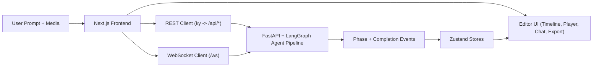

# Kinetograph Frontend

Kinetograph is an AI-native post-production interface: import raw footage, direct the pipeline with natural language, approve the paper edit, and ship a polished final render from one workspace.

This frontend is built for hackathon speed without hackathon fragility: real-time agent orchestration, timeline control, and export tooling in a single product loop.

## What We Built

- A cinematic landing experience that transitions into a full editing cockpit
- A multi-track timeline editor with drag-and-drop, transitions, trims, overlays, and transport controls
- A chat-first AI control panel that runs and edits an autonomous video pipeline
- A real-time event system that streams phase-by-phase progress from backend agents

## Architecture (At a Glance)



## Core Frontend Modules

- `src/app/editor/page.tsx`: Main editor shell (panels, transport, preview, keyboard shortcuts)
- `src/hooks/use-video-player.ts`: Dual-video playback engine for smooth cuts/transitions
- `src/hooks/use-kinetograph-ws.ts`: Real-time pipeline event sync and chat/status updates
- `src/lib/api.ts`: Typed REST integration for assets, paper edit, run/approve/edit flows
- `src/store/use-kinetograph-store.ts`: Timeline, assets, tracks, overlays, render state
- `src/store/use-chat-store.ts`: AI thread, agent activity, approval and completion messaging
- `src/components/*`: Feature modules (asset bin, timeline, chat panel, export panel)

## Runtime Flow

1. User imports footage and prompts the AI in the editor.
2. Frontend calls `POST /api/pipeline/run` and opens a live WebSocket stream.
3. Agent phase events update chat activity, editor state, and approval checkpoints.
4. At `awaiting_approval`, user refines timeline decisions directly in the UI.
5. Approval/edit calls resume pipeline execution.
6. On completion, frontend fetches outputs and loads the best mastered render into preview.

## Tech Stack

- Next.js 16 + React 19 + TypeScript
- Zustand for client state architecture
- `ky` for typed API requests
- Native WebSocket for real-time pipeline events
- `@dnd-kit` for timeline drag-and-drop
- Framer Motion for interface feedback and transitions

## Local Development

Prerequisites:

- Node.js 20+
- Backend API running at `http://localhost:8080`

Run:

```bash
npm install
npm run dev
```

Open:

- Landing page: `http://localhost:3000`
- Editor: `http://localhost:3000/editor`

## Configuration Notes

- REST calls use `/api/*` and are rewritten to `http://localhost:8080/api/*` in `next.config.ts`.
- WebSocket uses `NEXT_PUBLIC_WS_HOST` if set; otherwise defaults to `localhost:8080`.

Example:

```bash
export NEXT_PUBLIC_WS_HOST=localhost:8080
```

## Project Docs

- Backend contract: `API.md`
- Integration/deployment playbook: `docs/API_INTEGRATION_PLAYBOOK.md`

## Hackathon Value

Kinetograph compresses the full post-production lifecycle into one operator experience: AI orchestration, human approval, timeline precision, and final delivery. It is not a concept screen; it is a working, end-to-end editing system.
